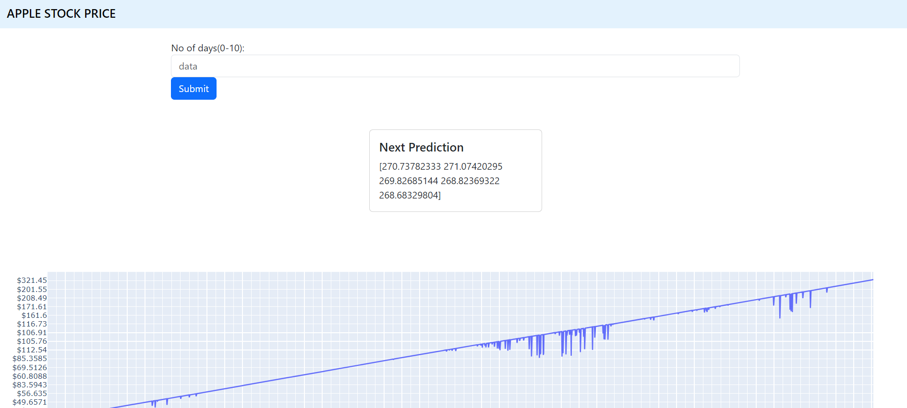

# Stock-Price-Prediction

Developed a stock price prediction model using both LSTM and ARIMA

Here's a live deployment - https://stock-price-prediction-qi60.onrender.com/

    

## Tech-Stack

- Python
- Flask
- HTML
- CSS

## Installation and Usage

To install and run this project, you need to have Python 3 installed on your computer. You also need to install and import the following Python libraries:

- flask
- render_template
- request
- numpy
- pandas
- sklearn
- seaborn
- prophet
- statsmodels

You can use any IDE or editor of your choice.

To download the code and data files for this project, you can clone this GitHub repository using the following command:

https://github.com/Amritha-07/Stock-Price-Prediction.git

To execute the code, you can run the following command:

python app.py

or

python app.py

You will see the output of the web application on your console or terminal.

To access the web application from your web browser, you can enter the URL of your local host followed by the port number (such as http://127.0.0.1:5000/).

## References

This project dataset was from the following sources:

- [Apple Stock Price from 1980-2021](https://www.kaggle.com/datasets/meetnagadia/apple-stock-price-from-19802021) from kagge
- [CAC40 Stocks Dataset 📈](https://www.kaggle.com/datasets/bryanb/cac40-stocks-dataset/code) from kaggle
